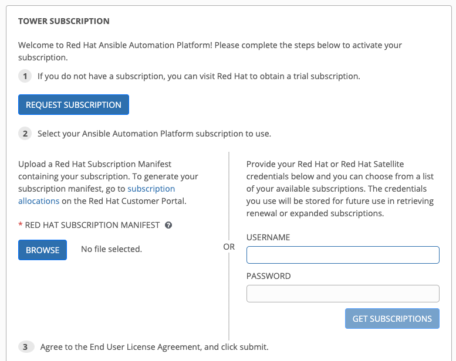

# About

This is a vagrant script that create a sandbox for Ansible Tower in RHEL8.
This Vagrant script will create VM using generic/rhel8 image for VirtualBox and install Ansible Tower. 

# Prerequisite

- 8 GB RAM, 2 vCPU
- VirtualBox
- Vagrant
- Vagrant reload plugin
- Free Red Hat Developer Account for RHEL subs
- Free Ansible Tower trial subs from Red Hat Customer Portal

## Installing VirtualBox

Please refer to official website
https://www.virtualbox.org/wiki/Downloads

## Installing Vagrant

Please refer to official website
https://www.vagrantup.com/downloads

## Installing Vagrant Reload plugin

```bash
vagrant plugin install vagrant-reload
```

Register Red Hat account to activate the RHEL8 Yum Repository
https://developers.redhat.com/register

## Configure Red Hat Login

Open and edit the file using any text editor vagrant/rhel8/vagrant/install-guest-additions.sh

```
vi ./vagrant/rhel8/vagrant/install-guest-additions.sh
```

Edit the following line and replace the <replaceme> with your username and password
```bash
sudo subscription-manager register --auto-attach --username <replaceme> --password <replaceme>
```

Example:

```bash
sudo subscription-manager register --auto-attach --username john --password johnsecretpassword
```

## Bring up the VM

```
cd vagrant
vagrant up
```

## SSH into the VM

```
vagrant ssh ansible-tower-1
```

## Accessing the ansible tower web console

Access ansible tower web console from the host browser.

http://192.168.5.11

username: admin
password: password

Note: You will need to activate using redhat subscription, get a free trials license from customer portal.



## For cleaning and destroy the VM

```
vagrant destroy
```

